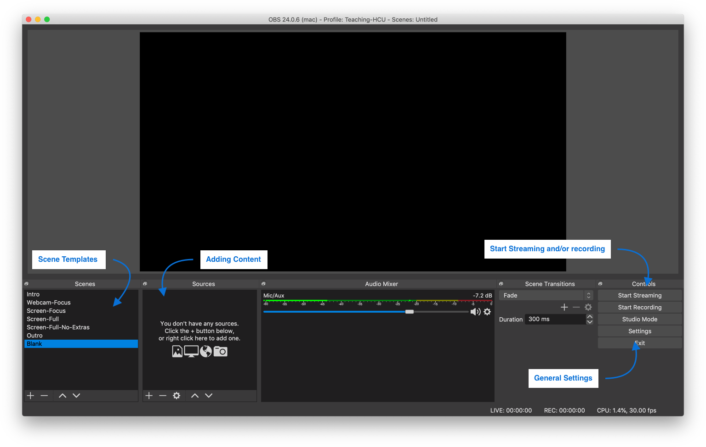
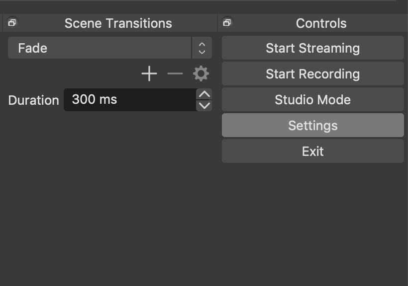
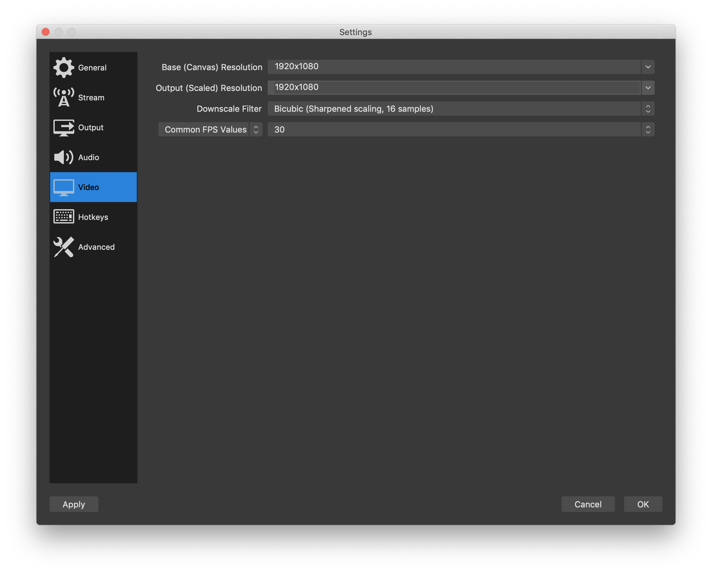

This document and the templates are work in progress...

# Open Broadcaster Software (Studio)

[Deutsche Version](#deutsche-version)

## Introduction

As COVID19 is changing the way we teach this semester, i explored multiple tools for creating video content for my students. I decided to pick Open Broadcaster Software (OBS) Studio, as it has all the features (scenes, webcam, app and text input) i need, it is open source and available for mac, windows and linux. In the following i will give a very brief introduction to the software, as well as a guide on how to use my prepared templates for any HCU colleagues that are interested (or anyone else who wants to use them as a boilerplate).

This is fast-forward introduction, focussing on using OBS for teaching. There are lots of detailed tutorials and introductions to OBS out there, e.g.: https://streamshark.io/obs-guide/

## What is OBS

OBS is a software that allows you to record and/or stream video content from your computer. It is very basic, but therefore, also extremely easy to use. You can create so called scenes, which allow you to combine different kinds of inputs (screen capture, webcam, images, text, web-content, etc.). You can switch between scenes while recording (e.g. switch from focus on presenter's webcam to focus on the screen capture).

OBS is free, open source and financially supported by a couple of companies: twitch, facebook, nvidia, logitech xplit, games done quick and others.

## Requirements

You only need a computer, everything else is optional. But for a good recording i would recommend: 
1. A secondary screen: Having a second screen where you can run the OBS app on and the the other screen for screen capturing. If you are livestreaming you will also need the OBS screen for interacting with your peers. 
2. A webcam: While many laptops and screens have built in cams, they are often in an not ideal angle, try to position the camera straight in front of you, in order to avoid weird distortions and angles.
3. A mic: Check if the mic build into your laptop is good enough, otherwise get an external one.

## Get started

### Download the software

Download and install the software form the [OBS website](https://obsproject.com/)

### Note

There is no undo/redo button 🤯!

### First launch

On first launch the software will run you through a tutorial for the initial settings, no worries, you can change everything later from the settings menu.

### Size/Resolution of your streaming output

I am personally recording & streaming a 1920*1080 video feed. But obviously this also depends on the content you produce. It also depends on your bandwidth. Slow bandwidth might require a lower resolution. To set your video output size:

Click on settings.

Go to Video and set the resolution. For slow bandwidth you could also reduce the frames per second (FPS).

### Adding Content

There are different type of contents, for creating your seminar, most importantly Browser (show content from the web, this can also be local content), Display Capture or Window (screen   recording), Image, Text and Video Capture Device (webcam). For adding new material, simply go to the "Sources" panel, click the "+" button and add the content you require. The initial configuration of the object can be opened through a double click or right-click > "Properties".

What is quite nice, you can reuse content you once added. The good thing about this, is also a possible problem, if you for example reuse a Browser-Source and change the URL, the URL will change in all other instances of that Browser-Source. Important to keep in mind.

### Adding Text > Text Width

Text is quite straight forward. Things to know, there are two colors, you need to adjust both, otherwise, you have a gradient in your text. If you want to write longer text and want the text to automatically wrap: scroll to the end of the text properties box, enter a text-width and check "wrap text".

There is a special option for live feeding text from a text file. I am using this to show students the current step we are working on. Therefore check "Read from file" and select a text file below. As you update your local text file, the text will update automatically in the video (again, good to have a second monitor to do these things while screen recording on the other).

### Scaling Content

For some reason scaling things, while keeping the height/width ratio locked is a bit buggy at times. The easiest way to fix this. Right-click on the content > Transform > Edit Transform > Bounding Box > Scale to inner bounds. Now you can resize as you want the content inside the bounding box will keep it's ratio.

### Fonts

I had some problems with certain fonts and using different font styles (bold, italic). Arial (even though not the nices font) has proven to be very reliable.

### Showing Presentations

I used a PDF-viewer like Acrobat in full screen on the secondary screen, which worked nicely, still able to see the OBS controls and could simply click through the presentation. I used my Screen or Window Template Scences for this.

### Exporting Video Files

Once you recorded a video, your video data is stored (per default, recommended) in an MKV file format. In order to turn this into a usable video format, like MP4, got to the Menu "File", select "Remux Recordings". Select the recordings you want to convert. And press the Remux button. After remuxing is done, press the "Clear finished items" button.

### Import HCU Templates

I prepared some templates for my classes at the HafenCity University Hamburg, everybody feel free to use them as your boilerplate.

For importing the files, download this repository, unpack and then go to "Scene Collection" > Import and select the hcu_templates/hcu_templates.json file.

After importing this you should see the following scenes. **One problem**: OBS stores all media as absolute paths, therefore, you need to reconnect all the media files i used. The media files are all located in hcu_templates/assets/... Simply double click the sources and reconnect. As all of you have different devices, you also need to set the Video Capture Device, as well as Secondary Screens and Windows.

#### Overview

All scenes have a hidden "Grid"-Source. OBS does not have guides or a grid, which makes aligning stuff hard. In order to make this easier, i have created a simple grid one can use to align and resize elements.

##### Intro

Simple Screen for the starting of your lecture. Simply double-click Meta-Title, Title and Date, change to your likings. Exchange the Background-Image with a slide from your seminar.

#### Outro

This is the companion to the Intro screen. The background image is sligthly smaller and, therefore, room to add e.g. contact infos.

#### Webcam-Focus

Webcam focus puts focus on the webcam input, i am using this for kicking off my lecture with some personal notes. Overview of topics on the right, coming from a text file and a preview of the slides following next in the upper right corner.

#### Other screens

The rest of the screens come in three different versions: Focus (Mix of Content, Webcam, Notes and Logo), Full (Mix of Content, Small Webcam and Logo), Full-No-Extras (Only Mix of Content). The Mix of content is either a full screen capture, a window capture or browser content.

### Zooming

As i will be doing software and coding tutorials mostly, an additional requirement for me is zooming onto elements in the software. OBS cannot do this out of the box. Windows and Mac both (and i am sure linux as well) have build in magnifiers. They are easy to use through hot keys. Following the setup for MacOS:

# Deutsche Version

## Hinweis

Mein Mac ist auf englisch eingestellt, deshalb haben die Buttons und Menüs im deutschen entsprechend andere Bezeichnungen.
